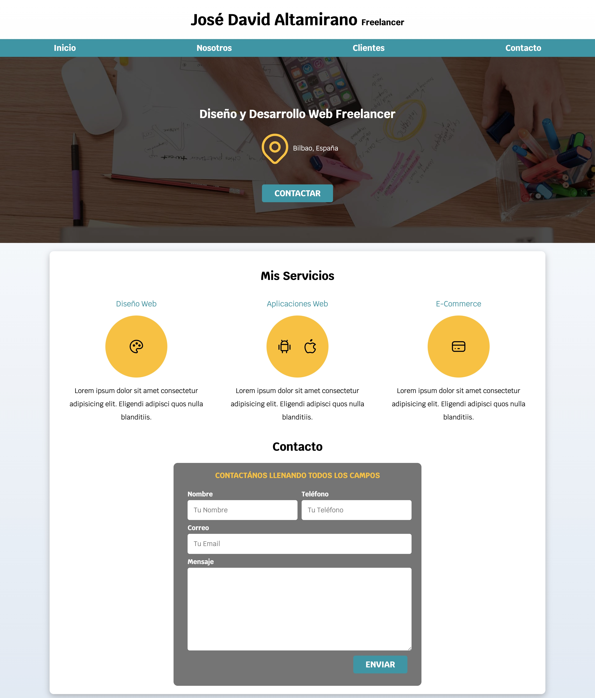
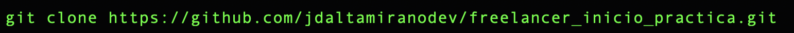

# Sitio Web Freelancer

## Puede ver el sitio Freelancer desplegado en Netlify [Freelancer](https://freelancer-jose-david-altamirano-mc.netlify.app/)



## Tabla de contenido

1. Información general
2. Estado actual
3. Tecnologías utilizadas
4. Instalación y prueba
5. Marcos de competencia

## Información general

Web estatica (landing Page) modelo Freelance. Consta de:

* Header: Nombre del autor.
* Menu de Navegación: Inicio, Nosotros, Clientes, Contacto.
* Localización: Especialidad, localización, forma de contacto.
* Servicios: Diseño Web, Aplicaciones Web, E-commerce.
* Formulario de Contacto: Incluye los campos; Nombre, Telefono, Correo, Mensaje y boton Enviar.
* Footer: Se incluye mensaje de derechos y nombre del autor.

## Estado actual

Finalizado.

## Tecnologías utilizadas

* HTML5
* CSS3
* Mac OS
* Terminal OS
* Git
* GitHub
* Netlify
* Visual Studio Code
* Trello

## Instalación y prueba

1. Copia la URL del proyecto
   
```
https://github.com/jdaltamiranodev/freelancer_inicio_practica.git
```

2. Abra una terminal, selecione la carpeta donde desea clonar el proyecto, después use el comando git clone y pegue la URL al final dejando un espacio.
3. Finalmente pulse enter. (Tenga en cuenta que debe tener instalado git)

 

```
$ git clone https://github.com/jdaltamiranodev/freelancer_inicio_practica.git
```
* Opcional: Puede copiar y pegar la linea anterior en su terminal en la carpeta elegida para clonar el proyecto.

4. Navegue hasta la carpeta clonada, abra el archivo index.html. Presione el botón derecho del ratón y elija la opción "Abrir en navegación predeterminado". Se abrira el navegador en la pagina 
   principal del proyecto y podrá navegar por el mismo.
   
## Marcos de competencia

* HTML5
* CSS3
* Flex Box
* CSS Grid
* Tablet Icon
* Normalize
* Responsive Design
* Responsively
* Mac OS
* Terminal OS
* Git
* GitHub
* Netlify
* Visual Studio Code
* Trello
